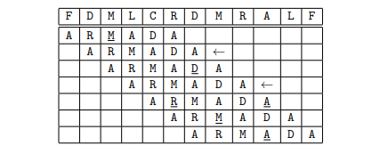

Given an initial setup, the WWII German Enigma encryption machine replaced each letter typed on the keyboard with some other letter. The replacement was quite complex, but the machine had a vulnerability: a letter would never be replaced by itself! This vulnerability was exploited by Alan Turing, who worked on Enigma's cryptanalysis during the war. The objective was to find the initial configuration of the machine using the assumption that the message contained a certain usual communication expression, such as the word **ARMADA**. These expressions were called cribs. If the encrypted message was, for example, **FDMLCRDMRALF**, the work of testing the possible configurations of the machine was simplified because the word **ARMADA**, if it were in this encrypted message, could only be in two positions, illustrated in the table below with an arrow. The other five positions could not correspond to the **ARMADA** crib because at least one letter of the crib, underlined in the table below, matches its counterpart in the encrypted message; as Enigma would never substitute a letter for itself, these five positions could be discarded in the tests.

In this problem, given an encrypted message and a crib, your program must compute the number of possible positions for the crib in the encrypted message.

### Input
The first line of the entry contains the encrypted message, which is a string of at least one letter and a maximum of 104 letters. The second line of the entry contains the crib, which is a string of at least one letter and at most the same number of letters as the message. Only the 26 capital letters, without accents, appear in the message and in the crib.

### Output
Print a line containing an integer, indicating the number of possible positions for the crib in the ciphered message.

|Input Examples       |Output Examples      |
|:--------------------|:--------------------|
|FDMLCRDMRALF         | 2                   |
|ARMADA               |                     |
|AAAAABABABABABABABABA| 7                   |
|ABA                  |                     |
